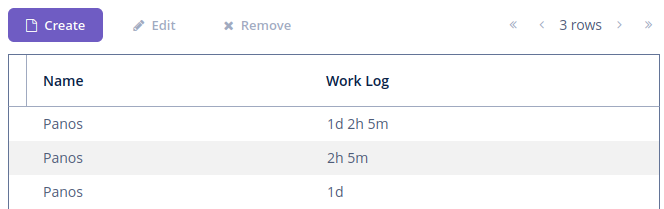

# Duration Field
# 时长组件

## OVERVIEW
## 介绍

This add-on provides support for the `java.time.Duration` data type through a specific UI component, by converting the type in a human redable format.
该扩展组件通过一个特殊的 UI 组件提供对 `java.time.Duration` 数据类型的支持，并提供可读的格式。

